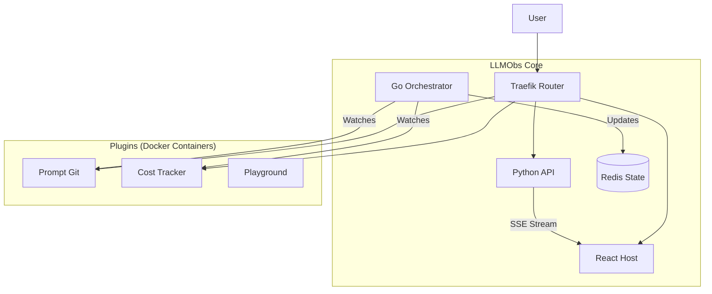

# Welcome to LLMObs 🔭

**The Micro-kernel Observability Platform for Large Language Models.**

LLMObs is an extensible, self-hosted platform designed to monitor, debug, and manage LLM applications. Unlike monolithic tools, LLMObs follows a **Micro-kernel Architecture**, allowing you to install only the features you need (Cost Tracking, Prompt Engineering, Datasets) as isolated plugins.

---

## 🏗 The Architecture

We separate the "Core" (Infrastructure) from the "Features" (Plugins).



---

## 🧭 Repository Guide

### 🟢 The Core
*   **[llmobs-core](https://github.com/YOUR_ORG/llmobs-core)**: The heart of the system. Contains the Go Orchestrator, Python Backend, and React Host Application.

### 🎨 The Design System
*   **[llmobs-ui-kit](https://github.com/YOUR_ORG/llmobs-ui-kit)**: The shared React component library (Buttons, Inputs, Sidebars) ensuring all plugins look native.

### 🔌 Official Plugins
*   **[plugin-prompt-git](https://github.com/YOUR_ORG/plugin-prompt-git)**: Version control for your prompts.
*   **[plugin-cost-tracker](https://github.com/YOUR_ORG/plugin-cost-tracker)**: Real-time token usage and cost monitoring.

### 🛠 Developer Tools
*   **[plugin-template](https://github.com/YOUR_ORG/plugin-template)**: A boilerplate repo to start building your own LLMObs plugin in seconds.

---

## 🚀 Getting Started

To run the platform locally, you only need Docker.

```bash
# 1. Create the network
docker network create llmobs_network

# 2. Clone and start Core
git clone https://github.com/YOUR_ORG/llmobs-core.git
cd llmobs-core
docker-compose up -d
```

Visit **[http://localhost](http://localhost)** to see your dashboard.

---

## 🤝 Contributing

We love community contributions! Since LLMObs is plugin-based, the easiest way to contribute is to **build a plugin**.

1.  Check out our [Contributing Guidelines](https://github.com/YOUR_ORG/.github/blob/main/CONTRIBUTING.md).
2.  Fork the [Plugin Template](https://github.com/YOUR_ORG/plugin-template).
3.  Build something cool (e.g., A Dataset Manager, A Fine-tuning Dashboard).
4.  Submit a PR to list it in our official registry!

---

<div align="center">
  <sub>Built with React, Python, Go, and Docker. ⚡️</sub>
</div>